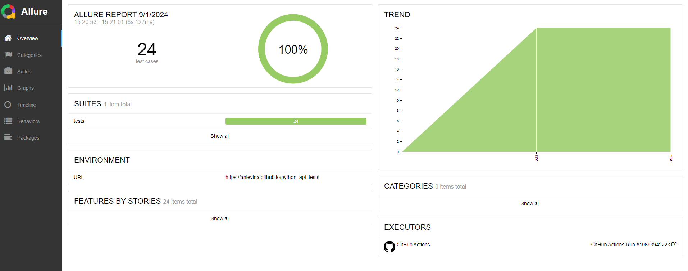

# Python API autotesting project

This project covers with API tests these endpoints https://automationexercise.com/api_list

The project was created to demonstrate proficiency in sending various types of requests and handling responses. Naturally, in real projects, comprehensive API tests should cover predefined flows.

If you want to run the project locally, please use the following command:
> pytest -s -m
> 
And the following commands if you want to generate a report locally:

> pytest --alluredir="allure_results"
> 
> allure serve allure_results

## Tools:
- Pytest (PyCharm)
- Allure
- GitHub (GitHub Actions, GitHub Pages)

## Allure report
Click <a href="https://anlevina.github.io/python_api_tests/24/">here</a> to open an example of allure report.

  

